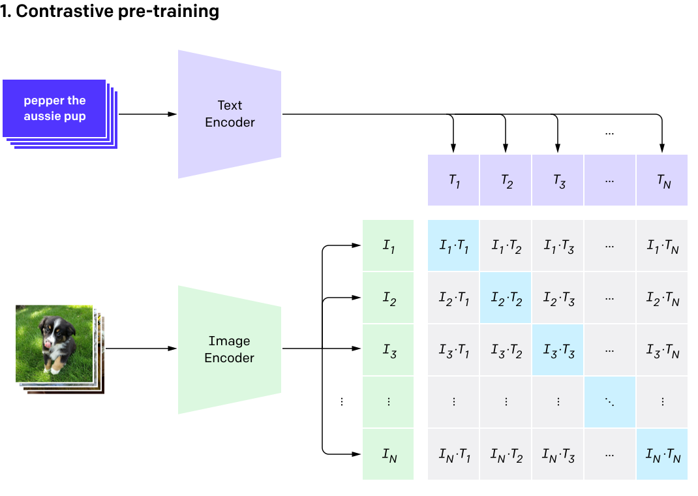

# 🔬 CLIP 데모와 CLIP의 실패에 대하여

## CLIP이란? ##
CLIP은 **사진과 문장을 각각 숫자 목록(벡터)으로 바꾸는** 모델입니다.
잘 어울리는 사진–문장 쌍은 그 벡터가 서로 **가깝게** 되도록 학습됐습니다.
(예: 강아지 사진 ↔ `"a dog"`).

그래서 문장 하나를 벡터로 바꾼 뒤, 모든 사진 벡터와 **얼마나 가까운지(cosine similarity)** 재면 문장에 가장 잘 맞는 사진을 찾을 수 있습니다. 이 데모가 하는 일이 바로 **검색(retrieval)** 이에요.
CLIP은 ChatGPT를 개발한 OpenAI가 웹에서 모은 4억 개의 (사진, 문장) 쌍으로 학습했습니다.


출처: OpenAI 블로그(CLIP: Connecting text and images)


## CLIP의 한계 ##
이처럼 CLIP은 검색(retrieval)이나 분류(classification) 태스크에서 높은 성능과 효율을 보여주지만, 치명적인 문제들도 가지고 있습니다.

여러 연구에 따르면 CLIP 모델에는 이미지 내의 공간 관계(spatial relations)를 이해하지 못하거나, 이미지 속 물체의 수를 정확히 세지 못하며(counting), 문장에 부정 표현이 들어 있어도 긍정문에 해당하는 이미지와 높은 유사도를 유지하는 등의 문제가 있습니다(negation).

이러한 문제를 완화하기 위해 여러 방법이 시도되고 있습니다. 예를 들어 공간 관계에 특화된 데이터로 supervised fine-tuning을 하거나, 새로운 학습 목표를 두고 재학습하는 방법 등이 도입되고 있습니다.

이런 문제가 발생하는 원인은 크게 두 가지로 볼 수 있습니다. 첫 번째는 perception failure로, 이미지에서 vision encoder가 객체와 특성을 제대로 인지하지 못해 발생하는 실패입니다. 이 경우에는 vision encoder를 보완하는 방식으로 해결할 수 있습니다. 두 번째는 두 모달리티를 결합하는 과정에서 발생하는 실패입니다. 이를 binding failure라고 부릅니다. CLIP은 이미지와 텍스트 토큰을 cosine similarity로 매칭하는데, 이때 두 모달리티 간의 정렬이 제대로 이루어지지 않았다는 해석입니다.

이런 문제가 있음에도 CLIP은 높은 성능과 효율성 때문에 여전히 많은 곳에서 사용되고 있습니다.

## 이번 프로젝트의 목적 ##
이번 프로젝트에서는 CLIP이 어떻게 작동하는지 데모를 통해 눈으로 확인하고, CLIP의 부정문(negation) 문제를 완화하기 위한 간단한 방법을 소개합니다.

---

## 준비물

시작하기 전에 컴퓨터에 아래 두 가지만 있으면 됩니다.

1. **Python 3.10 이상**
2. **git** — 없다면 <https://git-scm.com/downloads>에서 설치하세요.

그 외에 필요한 것들(패키지, Flickr30k 이미지, CLIP 모델)은 **아래 단계를 따라가면서** 내려받습니다.
- 인터넷 연결과 **약 10GB의 여유 공간**을 준비해 주세요.
- CLIP 모델(약 600MB)은 **처음 실행할 때 자동으로** 내려받아집니다.

---

## 실행하기 (단계별)

> 아래 명령들은 모두 **터미널(명령창)**에 입력합니다.
> 맥은 `터미널`, 윈도우는 `PowerShell`을 여세요.

### 0단계 · 저장소 내려받기 (git clone)

이 프로젝트를 내 컴퓨터로 복제합니다.
```bash
git clone https://github.com/Algorythmsz/OUTTA_CLIP_negation_failure.git
cd OUTTA_CLIP_negation_failure
```
✅ `OUTTA_CLIP_negation_failure` 폴더가 만들어지고, 그 안으로 이동합니다.
**이후 모든 명령은 이 폴더 안에서** 실행해요.

### 1단계 · (권장) 가상환경 만들기

프로젝트 전용 파이썬 공간을 만들어 다른 프로젝트의 패키지와 섞이지 않게 합니다.
```bash
python3 -m venv .venv
source .venv/bin/activate          # 윈도우(PowerShell): .venv\Scripts\Activate.ps1
```
✅ 터미널 줄 맨 앞에 `(.venv)`가 붙으면 성공입니다. (끝낼 땐 `deactivate`)

### 2단계 · 패키지 설치

```bash
pip install -r requirements.txt
```
- `torch`, `transformers` 등을 설치합니다. **처음엔 몇 분** 걸릴 수 있어요.

### 3단계 · Flickr30k 이미지 내려받기

이미지는 용량이 커서 저장소에 **들어 있지 않습니다.** 캡션 파일(`data/flickr30k/captions.txt`)은
이미 복제되어 있으니, 이미지(약 3만 장 · 압축파일 **4.4GB**)만 받아
`data/flickr30k/Images/` 폴더에 넣어주세요.

아래 명령을 **프로젝트 폴더(0단계에서 들어간 곳)에서** 그대로 복사해 실행하면 됩니다.
회원가입이나 토큰은 필요 없어요. (다운로드에 회선 속도에 따라 10~30분 정도 걸립니다.)

**맥 / 리눅스 (터미널)**
```bash
mkdir -p data/flickr30k
curl -L -C - -o data/flickr30k/flickr30k-images.zip \
  https://huggingface.co/datasets/nlphuji/flickr30k/resolve/main/flickr30k-images.zip

unzip -q data/flickr30k/flickr30k-images.zip -d data/flickr30k
mv data/flickr30k/flickr30k-images data/flickr30k/Images
rm data/flickr30k/flickr30k-images.zip        # 압축파일 삭제(4.4GB 확보)
```
- `-C -`는 **이어받기** 옵션입니다. 중간에 끊기면 같은 명령을 다시 실행하면 이어서 받습니다.

**윈도우 (PowerShell)**
```powershell
New-Item -ItemType Directory -Force data\flickr30k | Out-Null
curl.exe -L -C - -o data\flickr30k\flickr30k-images.zip `
  https://huggingface.co/datasets/nlphuji/flickr30k/resolve/main/flickr30k-images.zip

Expand-Archive data\flickr30k\flickr30k-images.zip -DestinationPath data\flickr30k
Rename-Item data\flickr30k\flickr30k-images Images
Remove-Item data\flickr30k\flickr30k-images.zip
```

**파이썬으로 받기 (선택 · 진행률 표시 + 자동 이어받기)**
```bash
pip install huggingface_hub
```
```python
# download_flickr30k.py 로 저장한 뒤  python3 download_flickr30k.py
import shutil, zipfile
from pathlib import Path
from huggingface_hub import hf_hub_download

root = Path("data/flickr30k")
images_dir = root / "Images"
if images_dir.exists():
    raise SystemExit(f"이미 존재합니다: {images_dir}")

zip_path = hf_hub_download(
    repo_id="nlphuji/flickr30k",
    filename="flickr30k-images.zip",
    repo_type="dataset",
)
with zipfile.ZipFile(zip_path) as zf:
    zf.extractall(root)                       # -> data/flickr30k/flickr30k-images/
shutil.move(str(root / "flickr30k-images"), str(images_dir))
print("완료:", len(list(images_dir.glob("*.jpg"))), "장")
```

> 다른 경로로 받고 싶다면 4·5단계의 `--images-dir` 값만 바꿔주면 됩니다.
> Kaggle에서 **"Flickr30k"**로 검색해 받아도 되고, 그때는 압축을 풀어 나온 `.jpg`들을
> `data/flickr30k/Images/` 안에 직접 넣으면 됩니다.

- 최종적으로 아래 모양이 되어야 합니다.
  ```
  data/flickr30k/Images/1000092795.jpg
  data/flickr30k/Images/1000268201.jpg
  ...
  ```
- ✅ 잘 들어갔는지 확인 (**31783**이 나오면 성공):
  ```bash
  ls data/flickr30k/Images | wc -l          # 윈도우(PowerShell): (ls data/flickr30k/Images).Count
  ```

### 4단계 · 검색용 "인덱스" 만들기  *(딱 한 번만)*

```bash
python3 src/data.py build-index \
  --images-dir data/flickr30k/Images \
  --captions-file data/flickr30k/captions.txt \
  --output-dir artifacts/flickr30k_clip
```
- **이 단계는 무엇을 하나요?** 사진 3만여 장을 CLIP으로 미리 **벡터로 변환**해
  `artifacts/flickr30k_clip/`에 저장합니다. 그래야 검색이 빨라져요.
- 처음 실행하면 **CLIP 모델(약 600MB)**을 자동으로 내려받습니다. (인터넷 필요)
- ✅ 이런 줄이 뜨면 성공:
  ```
  Saved index to: artifacts/flickr30k_clip
  Images: 31783 | Embedding dim: 512
  ```
- ⏱️ 애플 실리콘 ~2분, 일반 CPU는 더 오래 걸려요.
- 이 단계는 **한 번만** 하면 됩니다. 다음부터는 건너뛰어도 됩니다.

### 5단계 · 웹 데모 켜기

```bash
python3 src/data.py serve \
  --index-dir artifacts/flickr30k_clip \
  --images-dir data/flickr30k/Images \
  --port 8000
```
- ✅ 이런 줄이 뜨면 준비 완료:
  ```
  Index: 31783 images | serving on http://127.0.0.1:8000
  Press Ctrl+C to stop.
  ```

### 6단계 · 브라우저에서 열기

브라우저(크롬 등) 주소창에 아래를 입력하고 접속하세요.
```
http://127.0.0.1:8000
```
위쪽 탭 4개(① CLIP이란? · ② 검색 · ③ Negation · ④ NeRo)를 눌러가며 둘러보세요.

### 끝내기 / 다시 켜기

- **끝내기:** 서버를 켠 터미널에서 **Ctrl + C**.
- **다시 켜기:** 인덱스는 그대로 남아 있으니 **5단계 명령만** 다시 실행하면 됩니다. (3~4단계 생략)

---

## 웹에서 볼 수 있는 것 (탭 4개)

| 탭 | 무엇을 하나 | 직접 해보기 |
|----|------------|------------|
| **① CLIP이란?** | 왜 만들어졌는지, 두 인코더 구조, 대조 학습, zero-shot 추론까지 그림과 함께 설명 | 천천히 읽어보세요. N×N 유사도 행렬 그림이 핵심입니다 |
| **② 검색 데모** | 문장을 넣으면 닮은 사진을 순위대로 찾아줍니다 (cosine similarity 점수도 함께 표시) | `a dog running through the grass` 입력 → 그다음 `a spaceship on mars`(없는 것)도 넣어보세요. **없는 것을 검색해도 CLIP은 뭔가를 반환합니다** |
| **③ Negation 실패** | `"a man **without** a hat"`(모자 없는 남자)를 검색해도 CLIP은 **모자 쓴** 남자를 그대로 보여줍니다 | 프리셋 버튼을 눌러 "긍정 vs 부정"을 비교해보세요 |
| **④ NeRo-CLIP** | ③의 약점을 고치는 연구 소개 + 재현한 성능 점수 | 표에서 CLIP 39.66 → NeRo **54.99** 확인 |

---

## 조금 더 깊이 (선택)

**터미널에서 각 기능 따로 써보기**

| 명령 | 하는 일 |
|------|--------|
| `build-index` | 이미지를 벡터로 변환해 인덱스 저장 (3단계에서 쓴 것) |
| `eval` | 검색 성능 측정 (`Recall@K`) |
| `topk` | 문장으로 상위 k개 이미지 찾기 |
| `serve` | 웹 데모 실행 |

```bash
python3 src/data.py topk --index-dir artifacts/flickr30k_clip \
  --query "a dog running through the grass" --k 5
```

**NeRo-CLIP을 코드에서 직접 써보기** — 노트북에 예제가 들어 있습니다:
```
notebooks/nero_clip_usage.ipynb
```
CLIP과 학습된 어댑터를 불러와 부정 쿼리를 어떻게 교정하는지 단계별로 보여줍니다.

---

## 코드 구조

```
src/                  # 코드
├─ data.py            # 시작점 (build-index · eval · topk · serve)
├─ clip_model.py      # CLIP 로드 + 이미지/텍스트 임베딩
├─ retrieval.py       # cosine similarity 검색 + Recall@K
├─ webapp.py          # 브라우저 데모 (파이썬 표준 라이브러리만 사용)
├─ nero.py            # NeRo-CLIP 라우터 + 어댑터
└─ (index_io · dataset_io · utils)

notebooks/nero_clip_usage.ipynb   # NeRo-CLIP 사용 예제
assets/NeRo_CLIP_final.pdf        # NeRo-CLIP 논문 전문
data/flickr30k/                   # 데이터셋 (이미지는 직접 받아 넣기)
artifacts/                        # 생성물: 인덱스 (자동 생성)
```

---

## 📄 NeRo-CLIP 연구

**NeRo-CLIP: Negation-Routed adapter for frozen CLIP**
Dasol Lee · Jaehyun Kwak · Seungwon Park (Korea University COSE461 Final Project)

📎 **논문 전문(PDF): [assets/NeRo_CLIP_final.pdf](assets/NeRo_CLIP_final.pdf)**
- 논문 코드: <https://github.com/Algorythmsz/261RCOSE46101>
- 학습된 어댑터: 같은 저장소의 `pretrained/nero_lam0.75.pt`

### 무엇이 문제인가

CLIP은 문장을 **단어 주머니(bag-of-words)** 처럼 읽습니다. 문장에 "dog"가 들어 있으면, 그게
"강아지가 있다"인지 "강아지가 **없다**"인지 구분하지 않고 강아지 사진의 점수를 올려버려요.
`"a beach with no people"`을 검색하면 사람이 잔뜩 있는 해변 사진이 나오는 이유입니다.

이걸 **affirmation bias**(긍정 편향)라고 부릅니다. 원인은 두 가지예요.
- 웹에서 모은 학습 데이터에서 부정어가 들어간 캡션은 **1% 미만**입니다. 배울 기회가 거의 없었어요.
- 대조 학습(contrastive) 목표 자체가 문장을 순서 없는 개념 덩어리로 읽도록 보상합니다.

측정해보면 4지선다 부정 벤치마크(MCQ-Neg)에서 CLIP은 **39.66점**입니다. 찍어서 맞히면 25점이니
거의 못 푸는 셈이죠.

### 기존 해법과 그 대가

| 접근 | 방법 | 문제 |
|------|------|------|
| **재학습** (NegCLIP, ConCLIP, CLIP-CC12M) | 부정 데이터 56만~1200만 쌍으로 CLIP 전체를 다시 학습 | 비용이 크고, 3개 중 2개는 오히려 MCQ-Neg가 CLIP보다 **떨어짐** (25.07 / 26.40) |
| **활성값 스티어링** (Layerwise steering) | 텍스트 인코더 12개 층 전부에서 임베딩을 "부정 방향"으로 밀기 | **모든 문장**에 적용됨 → 일반 COCO 검색이 **4.30pp 하락** |

두 방법 모두 **개입 범위가 너무 넓다**는 공통점이 있습니다. 실제 검색에서 부정문은 드물고
평범한 긍정문이 대부분인데, 긍정문까지 건드려서 잘 되던 검색을 망치는 거예요.

### NeRo-CLIP의 아이디어: "필요할 때만 고친다"

핵심은 negation 교정을 *모델 전체를 바꾸는 문제*가 아니라 **선택적 개입(selective intervention)**
문제로 다시 정의한 것입니다. 구성 요소는 딱 세 개예요.

1. **정규식 라우터 (Regex Router)** — 문장에 부정어 11개
   (`not, n't, never, neither, no, none, nothing, empty, without, absent, missing`)
   중 하나라도 있는지 확인합니다. 있으면 → 고친다. 없으면 → **CLIP 원본 그대로 통과.**
   COCO 캡션 25,000개 중 **260개(1.04%)**에만 반응하므로, 나머지 98.96%는 손도 대지 않습니다.

2. **랭크-8 잔차 어댑터 (Residual Adapter)** — CLIP 텍스트 인코더의 **맨 마지막 [EOS] 임베딩**
   한 곳에만 붙는 아주 작은 보정기입니다.
   ```
   g(z) = z + W_up · tanh(W_down · z)      # W_down: 8×512, W_up: 512×8
   ```
   파라미터는 **8,192개뿐** (CLIP 백본보다 3자릿수 이상 작음). `W_up`을 0으로 초기화해서
   **학습 시작 시점엔 아무것도 안 바꾸는 항등함수**로 출발합니다. CLIP 인코더는 이미지·텍스트 모두 **완전히 동결.**

3. **MCQ + 검색 혼합 학습 목표** — 계수 λ 하나로 두 목표를 섞습니다.
   ```
   L = λ · L_MCQ + (1−λ) · L_retrieval
   ```
   - `L_MCQ` : 같은 이미지에 대한 4개 후보 캡션 중 정답을 골라내는 힘 (문장 vs 문장)
   - `L_retrieval` : 여러 이미지 사이에서 정답 이미지를 위로 올리는 힘 (이미지 vs 이미지)

   λ=1(MCQ만)로 학습하면 MCQ는 56.85로 가장 높지만 검색이 25.68로 **붕괴**합니다. 4개 후보만
   구분하면 되니, 상관없는 캡션끼리 섞여도 벌점이 없거든요. λ=0.75가 둘을 모두 만족하는 지점입니다.

### 성능

**부정 벤치마크 4종** (CLIP ViT-B/32, 동일 프로토콜로 재측정. ↑ 높을수록 좋음)

| 방법 | 파라미터 업데이트 | MCQ-Neg ↑ | Retrieval-Neg R@1 ↑ | SimpleNeg Top-1 ↑ | N-COCO R@1 ↑ |
|------|------|------|------|------|------|
| CLIP (기준) | — | 39.66 | 44.66 | 45.6 | 0.50 |
| ConCLIP | 백본 전체 (228K쌍) | 25.07 | 44.86 | 31.8 | 0.70 |
| NegCLIP | 백본 전체 (566K쌍) | 26.40 | **60.77** | 47.8 | 0.20 |
| CLIP-CC12M | 백본 전체 (12M쌍) | **55.13** | 49.58 | **55.3** | 0.40 |
| Layerwise steering | 없음 (추론 시 보정) | 41.60 | 36.17 | 52.6 | **0.80** |
| **NeRo-CLIP (λ=0.75, ours)** | **8K (백본 동결)** | **54.70** | **50.08** | 49.7 | 0.60 |

> CLIP 대비 **4개 벤치마크 전부 개선**. 특히 1200만 쌍으로 백본 전체를 재학습한 CLIP-CC12M(55.13)에
> 8천 파라미터 · 약 2.4만 쌍만으로 **54.70**까지 따라붙습니다.

**일반 검색 성능 보존** (COCO val2017 text→image R@1, 캡션 25,000개 대부분이 긍정문)

| 방법 | COCO R@1 ↑ | CLIP 대비 |
|------|------|------|
| CLIP (기준) | 30.36 | — |
| Layerwise steering | 26.06 | **−4.30** |
| **NeRo-CLIP (ours)** | **30.37** | **+0.01** |

> 이것이 라우팅의 핵심 효과입니다. 스티어링은 모든 문장을 건드려 4.30pp를 잃는 반면,
> NeRo-CLIP은 1.04%에만 개입하므로 일반 검색이 **사실상 그대로**입니다.

**λ 스윕 — 왜 0.75인가**

| λ | MCQ-Neg | Retrieval-Neg R@1 | 해석 |
|---|---|---|---|
| 0.0 (검색만) | 37.80 | 49.06 | 검색은 오르지만 MCQ가 CLIP 아래로 |
| 0.25 | 42.08 | 51.66 | |
| 0.5 | 42.82 | 50.80 | |
| **0.75 (권장)** | **54.70** | **50.08** | 둘 다 CLIP 위. 배포 설정 |
| 1.0 (MCQ만) | 56.85 | 25.68 | MCQ 가장 높음, 검색 붕괴(−18.98pp) |

λ=0.75는 **MCQ를 포기하지 않으면서 검색 성능을 살릴 수 있는 가장 큰 값**입니다.
MCQ-only 대비 MCQ는 2.15pp만 손해 보고, 검색은 24.40pp를 되찾습니다.

### 한계

- **백본**: ViT-B/32 하나에서만 검증했습니다. B/16·L/14에서도 같은 트레이드오프가 성립하는지는 미확인.
- **라우터 범위**: 정규식이라 `devoid of`, `lacking` 같은 **우회 표현은 놓칩니다.** 일부러 보수적으로
  잡은 것으로, 라우터를 넓히면 개입이 잦아져 일반 검색 보존이라는 장점이 사라집니다.
- **적용 범위**: "명시적 부정어 + 동결 CLIP 검색 파이프라인"이라는 특정 환경을 위한 사후 보정입니다.

> 재현 메모: 이 프로젝트(데모)는 Hugging Face CLIP(ViT-B/32)을 쓰며, ④ 탭에 표시되는 수치는
> 그 환경에서 다시 학습·측정한 값(MCQ-Neg **39.66 → 54.99**)입니다. CLIP 기준값 39.66은 논문과
> 정확히 일치하고, NeRo 54.99는 논문의 open_clip 결과 54.70과 사실상 동일합니다.

---

## 참고 자료

- [CLIP Behaves like a Bag-of-Words Model Cross-modally but not Uni-modally](https://arxiv.org/pdf/2502.03566)
- [Half-Truths Break Similarity-Based Retrieval](https://arxiv.org/pdf/2602.23906)
- [How can embedding models bind concepts?](https://arxiv.org/pdf/2605.31503)
- [Winoground: Probing Vision and Language Models for Visio-Linguistic Compositionality](https://arxiv.org/pdf/2204.03162)
- [When Negation Is a Geometry Problem in Vision-Language Models](https://arxiv.org/pdf/2603.20554)
